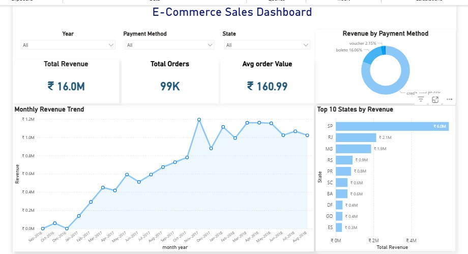

# E-commerce-sales-customer-insights-analytics

## Project Overview

This project analyzes customer, order, payment, and geographic data from an e-commerce platform to understand revenue performance, customer purchasing behavior, payment preferences, and operational efficiency.

The analysis was performed using **SQL, Python (Pandas), and Power BI** to transform raw transactional data into actionable business insights.

**Analysis Period:** September 2016 – October 2018

---

## Business Questions

* Which states and cities generate the highest revenue?
* How has revenue changed over time?
* Which payment methods are most preferred by customers?
* Who are the highest-value customers?
* How effective is the order fulfillment process?

---

## Dataset Snapshot

### Source Datasets

| Dataset   | Records |
| --------- | ------: |
| Customers |  99,441 |
| Orders    |  99,441 |
| Payments  | 103,886 |

### Final Analytical Dataset

| Metric              |        Value |
| ------------------- | -----------: |
| Rows                |      103,886 |
| Columns             |           16 |
| Total Revenue       | 16.0 Million |
| Average Order Value |       160.99 |

---

## Data Preparation

Data was validated, cleaned, and merged across customer, order, and payment datasets to create a consolidated analytical dataset for reporting and dashboard development.

Key preparation steps included:

* Handling missing values and validating data quality
* Checking duplicate records
* Converting `order_purchase_timestamp` to datetime format
* Merging Customers, Orders, and Payments datasets using `customer_id` and `order_id`
* Creating a consolidated analytical dataset for analysis and dashboard reporting

---

## Key Findings

### Revenue Performance

* Total revenue generated was approximately **16.0 million**
* Revenue increased significantly during 2017–2018
* Monthly revenue peaked at approximately **1.2 million**

### Geographic Analysis

| State | Revenue |
| ----- | ------: |
| SP    |   5.99M |
| RJ    |   2.14M |
| MG    |   1.87M |
| RS    |   0.89M |
| PR    |   0.81M |

**Insight:** São Paulo generated nearly three times more revenue than Rio de Janeiro, highlighting strong geographic concentration.

### Customer Analysis

* Most customers placed only one order
* Average customer order frequency was approximately **1.03 orders**
* Highest customer revenue contribution: **13,664.08**

**Insight:** Revenue is influenced by a relatively small group of high-value customers.

### Payment Preferences

| Payment Method | Transactions |
| -------------- | -----------: |
| Credit Card    |       76,795 |
| Boleto         |       19,784 |
| Voucher        |        5,775 |
| Debit Card     |        1,529 |

**Insight:** Credit cards accounted for approximately **74%** of all transactions.

### Operational Performance

* Delivered Orders: **96,478**
* Delivery Success Rate: **97%**
* Cancelled Orders: **625**

**Insight:** The platform maintained strong fulfillment performance with a low cancellation rate.

---

## Dashboard Preview

The Power BI dashboard provides an interactive view of:

* Revenue KPIs
* Monthly Revenue Trend
* Revenue by State
* Revenue by City
* Payment Method Analysis
* Order Status Analysis

<p align="center">
  
</p>

---

## Sample SQL Query

```sql
SELECT
    c.customer_state,
    SUM(p.payment_value) AS revenue
FROM customers c
JOIN orders o
    ON c.customer_id = o.customer_id
JOIN payments p
    ON o.order_id = p.order_id
GROUP BY c.customer_state
ORDER BY revenue DESC;
```

---

## Skills Demonstrated

* SQL Joins & Aggregations
* Data Cleaning & Transformation
* Exploratory Data Analysis (EDA)
* Revenue & Customer Analytics
* Geographic Analysis
* KPI Development
* Power BI Dashboard Design
* Business Insight Generation

---

## Project Files

- [README.md](README.md) — Complete project documentation, business objectives, methodology, key insights, and dashboard overview.
- [ecommerce_dashboard_overview.png](ecommerce_dashboard_overview.png) — Executive Power BI dashboard showcasing sales KPIs, customer behavior, product performance, and geographic insights.
- [ecommerce_sales_analysis.ipynb](ecommerce_sales_analysis.ipynb) — End-to-end Exploratory Data Analysis (EDA), data cleaning, feature engineering, business analysis, and visualizations using Python.
- [ecommerce_sales_analysis.sql](ecommerce_sales_analysis.sql) — SQL queries for data exploration, KPI calculations, customer analysis, sales performance, and business reporting.
- [ecommerce_sales_dashboard.pbix](ecommerce_sales_dashboard.pbix) — Interactive Power BI dashboard built for executive reporting and business decision-making.

---

## Repository Structure

```text
E-Commerce-Sales-Customer-Insights-Analytics/
│
├── README.md
├── ecommerce_dashboard_overview.png
├── ecommerce_sales_analysis.ipynb
├── ecommerce_sales_analysis.sql
└── ecommerce_sales_dashboard.pbix
```

---

## Business Takeaway

The analysis revealed that revenue is heavily concentrated in a few major markets, particularly São Paulo, while most customers made only a single purchase. This suggests that future growth opportunities may lie in improving customer retention and increasing repeat purchases rather than relying solely on new customer acquisition.

This project demonstrates an end-to-end analytics workflow using SQL, Python, and Power BI to convert raw transactional data into actionable business insights.
